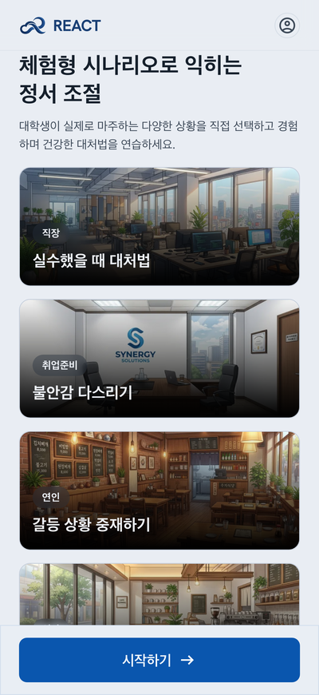
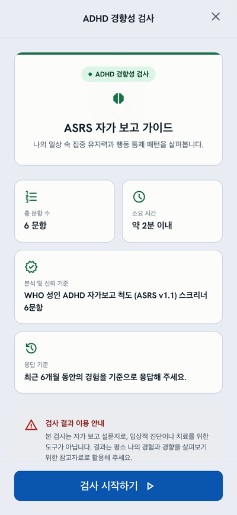
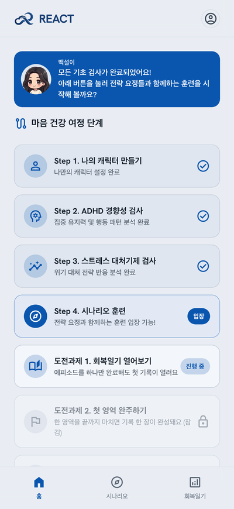
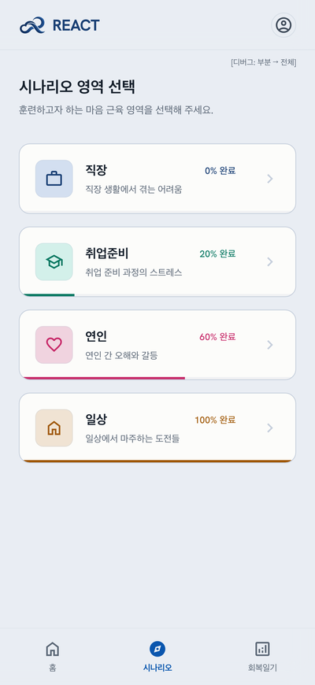
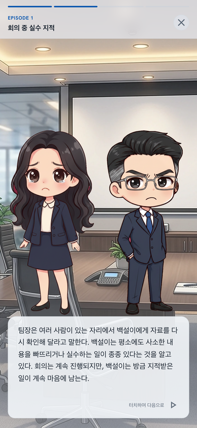
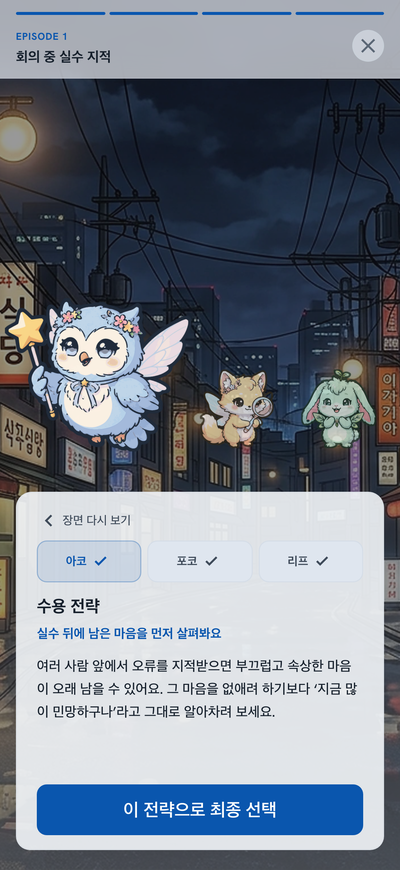
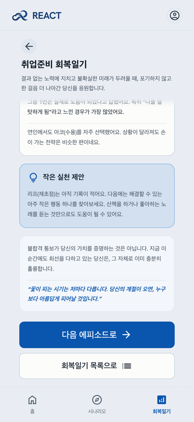
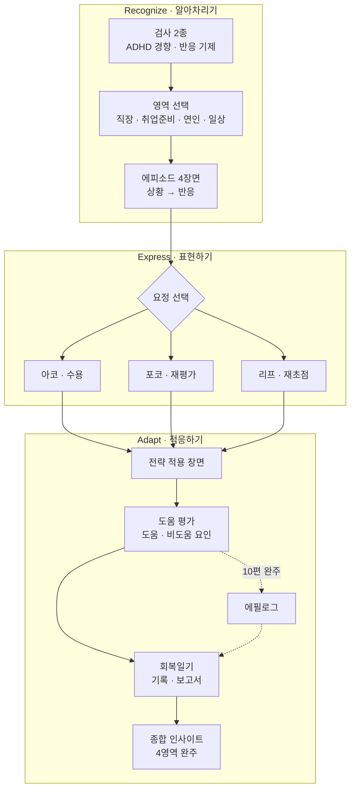
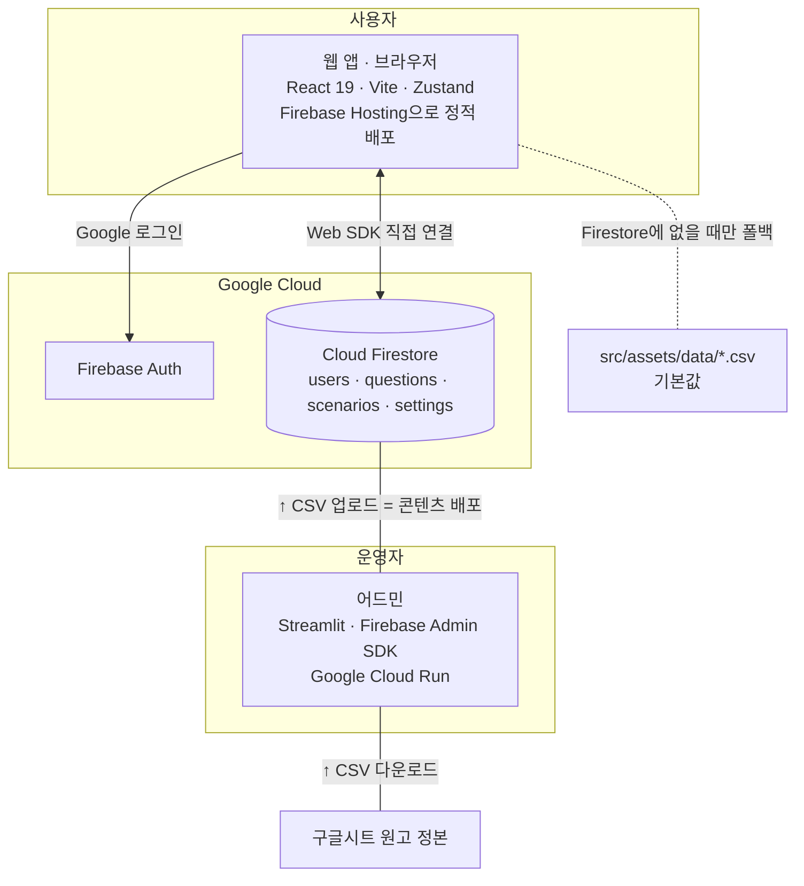

# SYU-REACT

[](LICENSE)


[](https://syu-react.web.app)

**REACT**는 **Recognize – Express – Adapt Coping Tool**의 약자이다. 스트레스 상황에서 자기 반응을
**알아차리고**(Recognize), 감정을 **표현하고**(Express), 상황에 맞는 대처 전략으로 **적응**(Adapt)하는 과정을
연습하도록 돕는 웹 서비스다. ADHD 경향이 있는 대학생을 첫 사용자로 두고 설계했다.

성인 ADHD 경향 자가 점검과 스트레스 대처 유형 검사를 한 뒤, 직장·취업준비·연인·일상 네 영역의 시나리오를
따라가며 자신의 반응 유형에 맞는 대처 전략을 고르고 그 결과를 회복일기로 되돌아본다.
삼육대학교 상담심리학과 SYU-REACT 연구팀(콘텐츠·검수)과 TYUP Studio(개발)의 산학협력 프로젝트
(삼육대학교 SW중심대학사업단 산학협력 공동 프로젝트)로 2026년 여름에 개발했다.

- 서비스: https://syu-react.web.app
- 구성: 웹 앱(`syu-react-frontend/`) + 운영 어드민(`syu-react-admin/`) — 백엔드 API 서버 없이 둘 다 Firestore에 직접 연결한다.

> **라이선스** — 소스 코드는 MIT(`LICENSE`)이다. 시나리오·검사 문항·이미지·로고 등 콘텐츠와 에셋은
> MIT 대상이 아니며 `NOTICE.md`의 권리 고지를 따른다.

> **이 서비스는 임상 진단·치료 도구가 아니다.** 검사 결과는 *경향*이며, 화면에도 그렇게 안내한다.

<p align="center">
  
  
  
  
</p>
<p align="center">
  
  
  
  
</p>
<p align="center"><sub>iPhone 17 화면(402×874), 진행 순서대로. 더 많은 화면은 <a href="docs/screenshots.md">docs/screenshots.md</a>.</sub></p>

## 목차

- [기획 배경](#기획-배경)
- [심리학적 기반](#심리학적-기반)
- [서비스 흐름 — REACT 세 단계](#서비스-흐름--react-세-단계)
- [개발·검증 방법](#개발검증-방법)
- [주요 기능 (요약)](#주요-기능-요약)
- [기술 스택](#기술-스택)
- [실행하기](#실행하기)
- [저장소(Repository) 구성](#저장소repository-구성)
- [검사 도구 출처](#검사-도구-출처)
- [참고문헌](#참고문헌)
- [만든 사람들](#만든-사람들)

## 기획 배경

- 국내 성인 ADHD 진단은 2020년 약 2.5만 명에서 2024년 약 12.3만 명으로 급증했다(남인순, 2025).
  아동기에 진단되지 않았던 증상이 성인기에 평가·진단으로 드러나는 흐름으로 읽힌다.
- 성인기에는 과잉행동·충동성보다 **정서 조절의 어려움과 학업·대인 적응 문제**가 전면에 나온다
  (김미란·이민규, 2018; Weyandt & DuPaul, 2006). 아동기에 정서조절·사회기술 개입이 충분하지 않았던 경우
  또래 관계, 갈등 해결, 진로 결정 같은 발달 과업에서 적응적 전략을 세우지 못할 위험이 높다(김태민·서경현, 2014).
- 대학생의 주된 스트레스원은 또래·진로·학업이다(김성경, 2003; 이경순·서경현, 2011). 시간관리 훈련이나
  인지행동 프로그램 같은 기존 접근은 유용하지만 이 집단이 겪는 **정서 처리의 특수성**을 일상 맥락에서
  반복 연습하게 하는 데는 한계가 있었다.

그래서 REACT는 "무엇이 문제인지 진단"하지 않는다. **자신의 반응을 알아차리고 → 대처 전략을 골라 써 보고 →
결과를 되돌아보는** 한 사이클을 실제와 닮은 상황 속에서 여러 번 반복하게 하는 **디지털 자기조절 지원 도구**로 설계했다.

## 심리학적 기반

### 1. 정서조절 전략 3종 — 요정 캐릭터

시나리오의 갈림길마다 요정 셋이 서로 다른 **적응적 정서조절 전략**을 제안한다. 세 전략은 인지적 정서조절
전략 척도(CERQ; Garnefski, Kraaij, & Spinhoven, 2001)의 적응적 전략 범주에서 가져왔다.

| 요정 | 전략 | 한 줄 정의 (앱 엔딩 문구) |
|---|---|---|
| 아코 | **수용**(Acceptance) | 지금 느끼는 감정을 있는 그대로 받아들이는 것 |
| 포코 | **재평가**(Cognitive Reappraisal) | 생각에서 한 걸음 물러나 다시 바라보는 것 |
| 리프 | **재초점**(Refocusing) | 지금 내가 할 수 있는 한 가지에 집중하는 것 |

아코는 감정을 판단하거나 억누르지 않고 알아차려 받아들이는 활동을, 포코는 감정을 일으킨 생각을 다른 관점에서 균형 있게 다시 보는 활동을, 리프는 부정적인 생각에 머무르기보다 지금 해결할 수 있는 문제와 행동으로 주의를 옮기는 활동을 안내한다.

사용자는 전략을 고르고 그 전략을 적용한 뒤의 장면을 보고 "도움이 되었는지"와 **그 이유**(도움 요인·비도움
요인, 전역 팔레트 8+8 — 예: "감정을 편안하게 해줌", "상황에 맞지 않음")를 평가한다. 정답이 정해진 퀴즈가 아니라 같은 상황에 세 전략을 번갈아 써 보며
**자기에게 맞는 전략의 감각**을 쌓는 것이 목적이다.

### 2. 스트레스 반응 기제 3축 — 인지·정서·행동

스트레스를 받았을 때 먼저 움직이는 것이 **생각**(인지)인지, **감정**(정서)인지, **행동**인지를 12문항(예/아니요)으로
살핀다. 연구팀이 세 차원으로 자체 구성한 문항이다. 결과는 단일 3유형·복합 3유형·균형 1유형으로 분류된다
(모두 같은 답이면 판정을 보류한다). 유형 설명문은 연구팀 검수를 거친 원문을 코드에서 글자 그대로 고정한다.

이 유형은 단순한 결과 화면에 그치지 않는다. **시나리오 40편 모두가 반응 유형별로 다른 장면**을 갖는다 —
같은 사건을 인지형은 "원인을 되짚는" 장면으로, 정서형은 "감정이 앞서는" 장면으로, 행동형은 "먼저 움직이거나
피하는" 장면으로 서술해 사용자가 자기 반응 방식을 이야기 속에서 다시 만나게 한다.

### 3. ADHD 경향 스크리닝 — ASRS v1.1

WHO 성인 ADHD 자가보고 척도(ASRS v1.1; Kessler et al., 2005) Part A 6문항의 한국어 번안을 쓴다.
문항당 0~4점 리커트, 환산점수 = (원점수 / 24) × 100. 점수는 **경향**으로만 안내하며 진단 기준으로 쓰지 않는다.

### 4. 시나리오 기반 연습과 자기 관찰

- **시나리오 40편** — 직장·취업준비·연인·일상 네 영역 × 10편, 비주얼 노벨 형식이다. 각 편은 4장면(상황 → 반응의 전개)으로 진행되고
  주인공 '백설이'는 사용자가 고른 성별과 닉네임으로 개인화된다. 시나리오 원고 40편은 연구팀이 집필·검수했고,
  요정 셋의 조언은 영역을 나눠 집필했다.
- **회복일기** — 영역별 훈련 기록(선택한 전략의 분포, 도움 체감도, 도움이 된 이유 Top3)을 모아 보여 주고
  첫 영역을 완주하면 **정서 대응 프로필**(반응 유형 × 전략 경향) 보고서를, 네 영역을 모두 완주하면
  **종합 인사이트**를 연다. 자기 반응에 이름을 붙이고 결과를 되돌아보는 과정을 반복하게 하려는 장치이다.
- **에필로그** — 영역 10편을 마치면 열리는 마무리 이야기로, 같은 상황을 다르게 지나가는 백설이를 보여 준다.

## 서비스 흐름 — REACT 세 단계

| 단계 | 화면 | 사용자가 하는 것 |
|---|---|---|
| **Recognize** 알아차리기 | 검사 2종 → 시나리오 장면 | 나의 반응 유형과 ADHD 경향을 확인하고 백설이의 생각·감정·행동 서술 속에서 자기 반응을 발견 |
| **Express** 표현하기 | 요정 선택 → 전략 조언 | 세 전략 중 지금 상황에 써 볼 것을 고르고 요정의 구체적 조언을 읽음 |
| **Adapt** 적응하기 | 적용 장면 → 도움 평가 → 회복일기·보고서 → 에필로그 | 전략을 적용한 결과를 보고 평가하며 기록이 쌓이면 자기 패턴을 확인 |



## 개발·검증 방법

- **연구 설계는 ADDIE 모형**을 따랐다 — 분석(Analysis) → 설계(Design) → 개발(Development) → 실행(Implementation) →
  평가(Evaluation). 분석에서 성인 ADHD 특성과 상황 요인, 선행연구를 검토하고 설계에서 정서·상담 전문가 자문을 받아
  검사·시나리오 구조를 잡았다. 개발에서 연구팀이 원고 40편과 에필로그를 썼고 실행에서 팀 회의 9차와
  사용자 인수 테스트(UAT) 3회 이상으로 검수·수정했다. 평가에 해당하는 효과 검증 연구는 연구팀이 별도로 계획한다.
- **소프트웨어는 폭포수 모델**(Waterfall Model)로 진행했다. 요구사항 분석 → 설계 → 구현 → 테스트 → 유지보수를 순서대로 밟아 팀원 전원이
  개발 생애주기를 단계별로 경험하게 했다. 일정은 WBS(Work Breakdown Structure, 작업 분류 체계)로 관리하고 의사결정과 산출물은 노션에 기록했다.
- **기획 산출물** — 유저 플로우는 Mermaid 코드로 그려 AI 도구가 읽을 수 있게 했고 구글 시트로 버전을 관리했다.
  손으로 그린 저해상도(lo-fi) 와이어프레임을 Figma 프로토타입으로 이어 흐름을 검토한 뒤 요구사항을 정의했다.
- **콘텐츠는 코드와 분리된 정본을 둔다.** 원고는 구글시트 → CSV → Firestore로 흐르고 어드민에서 CSV를
  올리는 것이 곧 콘텐츠 배포이다. 채점 규칙과 유형 설명문처럼 연구팀이 확정한 문안은 단위 테스트로 고정해
  UI 변경이 내용을 건드리지 못하게 했다.
- **윤리·안전** — 검사는 진단이 아님을 화면마다 고지하고 개인정보 처리방침과 보호책임자 연락처를 앱 안에 두며,
  사용자가 언제든 기록 초기화·계정 삭제를 할 수 있다.

## 주요 기능 (요약)

1. **검사 2종** — ADHD 경향(ASRS v1.1 6문항)과 스트레스 반응 기제(인지·정서·행동 12문항).
2. **시나리오 40편 + 에필로그 4편** — 영역별 10편, 4장면. 요정 셋의 전략 중 하나를 고르고 적용 뒤 장면을 보고 평가.
3. **회복일기·보고서** — 영역별 기록, 정서 대응 프로필, 종합 인사이트.

## 기술 스택

| 영역 | 스택 | 배포 |
|---|---|---|
| 웹 앱 | React 19 (UI 라이브러리)<br>TypeScript (정적 타입 — `tsc -b`로 빌드 전 타입 검사)<br>Vite (개발 서버·번들러)<br>Tailwind CSS v4 (유틸리티 CSS — `@theme` 블록이 디자인 토큰)<br>Zustand (전역 상태 관리 — 스토어 4개가 Firestore 접근까지 담당)<br>Firebase Web SDK (Auth·Firestore 클라이언트)<br>lucide-react (아이콘)<br>Vitest · Testing Library (단위·컴포넌트 테스트, jsdom)<br>Playwright (E2E 테스트)<br>oxlint (린터) | Firebase Hosting (정적 배포) |
| 어드민 | Python 3.13<br>Streamlit (파이썬 웹 UI 프레임워크)<br>Firebase Admin SDK (서버 권한으로 Firestore·Auth 접근)<br>pandas (CSV 검증·결과 집계)<br>python-dotenv (`.env.local` 로드)<br>pytest (테스트) | Google Cloud Run (Docker 컨테이너) |
| 데이터·인증 | Cloud Firestore (NoSQL 문서 DB — `users/{uid}` 단일 문서 누적, `questions`·`scenarios`·`settings` 컬렉션)<br>Firebase Authentication (Google 로그인)<br>CSV (`src/assets/data/*.csv` — 문항·시나리오 기본값, 구글시트 정본에서 내보냄) | — |
| 기획·협업 도구 | Notion (회의록·의사결정·온보딩 기록)<br>GitHub (코드·이력 관리)<br>Google Sheets (원고 정본·유저 플로우 버전 관리)<br>Figma (프로토타입)<br>Google Stitch (hi-fi 와이어프레임)<br>Gemini (캐릭터·배경 이미지 생성)<br>Mermaid (유저 플로우·다이어그램) | — |

### 설계 특징

- **라우팅 라이브러리 없음** — `App.tsx`가 `Page` 유니온 상태와 `location.hash`를 동기화하는 수동 상태 머신이다.
- **CSV가 콘텐츠 DB** — 검사 문항과 시나리오는 `src/assets/data/*.csv`를 기본값으로 쓰고 Firestore에 `csvText`가
  있으면 그것으로 대체한다. 어드민의 CSV 업로드가 곧 콘텐츠 배포이다.
- **디자인 토큰** — `DESIGN.md` → `src/index.css`의 Tailwind `@theme` → 시맨틱 유틸리티(`bg-surface-container` 등)로
  색이 흐른다. 컴포넌트에 색상 하드코딩을 두지 않는다.
- **Mock 모드** — Firebase 키가 없으면 검사·시나리오 스토어가 `localStorage`로 동작해 키 없이도 화면을 볼 수 있다
  (로그인만 예외).

### 시스템 아키텍처



## 실행하기

### 웹 앱

```bash
cd syu-react-frontend
npm ci
cp .env.example .env.local     # Firebase 웹 앱 설정값을 채웁니다 (없으면 Mock 모드)
npm run dev
```

검증은 세 가지로 한다.

```bash
npm run test:run   # vitest — 단위·컴포넌트 테스트 (1,000개 이상)
npm run build      # tsc -b 타입 체크 → vite build
npm run lint       # oxlint
```

`npm run test:e2e`(Playwright)와 `npm run test:integration`(Firebase 에뮬레이터, JDK 21 필요)은 별도 환경이 필요하다.
`npm run check:assets`는 CSV가 가리키는 이미지 파일이 전부 있는지 확인한다.

### 어드민

```bash
cd syu-react-admin
python3.13 -m venv venv && venv/bin/pip install -r requirements.txt
cp .env.example .env.local                     # ADMIN_PASSWORD (없으면 로그인 불가)
# .streamlit/secrets.toml 의 [firebase] 섹션에 서비스 계정 키 — 없으면 Mock 모드
venv/bin/streamlit run streamlit_app.py
venv/bin/python -m pytest -q                   # 379개 테스트
```

메뉴는 대시보드 · 유저 관리 · 검사 결과 분석 · 문항 관리(CSV) · 시나리오 관리(CSV) · 약관·공지 관리의 6개이다.
운영 절차는 `docs/manual/admin-operations.md`에 있다.

## 저장소(Repository) 구성

```
syu-react-frontend/   웹 앱 (src/pages · components · store · utils · assets/data/*.csv, public/scenario 이미지)
syu-react-admin/      Streamlit 어드민 + Dockerfile + Cloud Run 배포 스크립트 + pytest
docs/                 project-spec.md(백서) · manual/admin-operations.md(운영 매뉴얼) · user-flow.csv
```

## 검사 도구 출처

- **ADHD 경향** — WHO 성인 ADHD 자가보고 척도(ASRS v1.1) 스크리너 6문항의 한국어 번안.
- **스트레스 대처기제** — 연구팀이 인지·정서·행동 세 차원으로 자체 구성한 12문항(예/아니요).
  인지적 정서조절 전략(CERQ) 등 기존 척도를 참고했으나 문항은 독자적으로 작성했다.

두 검사 모두 임상 진단이나 치료를 위한 도구가 아니다.

## 참고문헌

- 김미란, 이민규 (2018). 성인 ADHD 성향이 우울에 미치는 영향: 정서조절곤란과 자기격려의 매개효과. *한국심리학회지: 건강, 23*(2), 475–488. https://doi.org/10.17315/kjhp.2018.23.2.009
- 김성경 (2003). 대학신입생의 스트레스와 학교적응에 관한 연구. *청소년학연구, 10*(2), 215–237. https://kiss.kstudy.com/Detail/Ar?key=2061617
- 김태민, 서경현 (2014). 대학생의 성인 ADHD 성향과 인터넷 중독 간의 관계: 대인관계 문제의 매개효과를 중심으로. *한국심리학회지: 건강, 19*(3), 813–828. https://doi.org/10.17315/kjhp.2014.19.3.010
- 남인순 (2025. 10. 2.). 성인 ADHD 환자 10만명 넘었다, 진료비 1천억원 돌파 [보도자료]. https://theminjoo.kr/main/sub/news/view.php?brd=17&post=1213823
- 이경순, 서경현 (2011). 대학생의 대인관계 스트레스 및 부모와의 갈등과 주관적 웰빙: 원한 동기의 매개효과를 중심으로. *한국심리학회지: 건강, 16*(3), 595–608. https://doi.org/10.17315/kjhp.2011.16.3.010
- Garnefski, N., Kraaij, V., & Spinhoven, P. (2001). Negative life events, cognitive emotion regulation and emotional problems. *Personality and Individual Differences, 30*(8), 1311–1327. https://doi.org/10.1016/S0191-8869(00)00113-6
- Kessler, R. C., Adler, L., Ames, M., et al. (2005). The World Health Organization Adult ADHD Self-Report Scale (ASRS): A short screening scale for use in the general population. *Psychological Medicine, 35*(2), 245–256. https://doi.org/10.1017/S0033291704002892
- Weyandt, L. L., & DuPaul, G. (2006). ADHD in college students. *Journal of Attention Disorders, 10*(1), 9–19. https://doi.org/10.1177/1087054705286061

「기획 배경」의 국내 문헌 서지는 연구팀의 프로젝트 지원신청서를 따랐다.

## 만든 사람들

삼육대학교 상담심리학과 SYU-REACT 연구팀이 서비스·콘텐츠 기획, 와이어프레임과 에셋 제작, UAT 검수를 맡았고
개발자 1인이 개발 프로젝트 관리(PM)와 구현을 맡았다. 책임교수는 정구철(삼육대학교 상담심리학과)이다.

| 이름   | 학과             | 역할 |
| ------ | ---------------- | ---- |
| 여명이 | 상담심리학과(박) | **콘텐츠 총괄 \| 시나리오 일상영역 기획(원고 전체 집필) \| 프로젝트 소개자료·보고서 작성**<br>- 작성 : 사업 지원신청서(제안서) 갱신<br>- 작성 : 요구사항 정의서 v0.0.1 · 유저 플로우 v0.1~0.2(전체)<br>- 설계 : 회복 전략 3종(수용·재평가·재초점)과 요정 체계<br>- 검토 : 척도 저작권(ASRS)<br>- 설계 : 와이어프레임 파트2(검사·시나리오)<br>- 집필 : 시나리오 40편 원고(4영역 × 10편, 인지·정서·행동 분기)<br>- 관리 : 원고 정본(구글시트)과 콘텐츠 검수 총괄<br>- 검수 : UAT 회복일기 파트<br>- 집필 : 일상 영역 요정 조언 10편<br>- 정리 : 선행연구<br>- 검토 : 약관·개인정보 처리방침 문안<br>- 작성 : 중간보고서·프로젝트 소개자료<br>- 총괄 : 최종 결과보고서 |
| 황 현 | 상담심리학과(박) | **화면 설계(메인·결과 화면) \| ADHD·스트레스 반응 기제 해석지침 \| 시각 자료 구성·인건비 처리**<br>- 설계 : 결과 화면(파트3-2) lo-fi 와이어프레임<br>- 설계 : 유저 플로우 메인페이지 v0.1.0 · 와이어프레임 SW 메인·파트3<br>- 설계 : 최초 1회 보고서·회복일기·종합 인사이트 hi-fi 템플릿(김영원과 공동)<br>- 제안 : 시나리오 개입 시점 정리<br>- 마련 : ADHD·스트레스 반응 기제 해석 지침<br>- 구성 : 결과 시각 자료(표·그래프)<br>- 제안 : 요정 이름(아코·포코·리프)과 엔딩 마무리 인사<br>- 처리 : 전문가·연구팀 인건비 |
| 김영원 | 상담심리학과(석) | **검사·척도 설계 \| 시나리오 직장영역 기획 \| 행정 소통·lo-fi/hi-fi**<br>- 설계 : 메인·마이페이지(파트3-1) lo-fi 와이어프레임<br>- 구성 : 척도(구글폼)와 연구윤리 사항<br>- 발의 : 결과 화면 시각화(버블 그래프) 아이디어<br>- 제안 : 요정을 동물 캐릭터로<br>- 설계 : 최초 1회 보고서·회복일기·종합 인사이트 hi-fi 템플릿(황현과 공동)<br>- 확정 : 검사 설계(재검사 미도입 등)<br>- 검수 : UAT 랜딩·엔딩 파트 — 다수 버그 최초 발견<br>- 집필 : 직장 영역 요정 조언 10편<br>- 담당 : 개인정보 보호책임자<br>- 소통 : 행정 처리(사업단) |
| 김도영 | 상담심리학과(학) | **캐릭터 원안 \| 시나리오 취업준비영역 기획 \| 엔딩페이지 기획 \| 회의록·검수**<br>- 작성 : 매주 회의록<br>- 설계 : 와이어프레임 SW 파트1 보완<br>- 원안 : 주인공 '백설이' 캐릭터 남·여(조세현과 공동)<br>- 원안 : 요정 3종 캐릭터(조세현과 공동)<br>- 구체화 : 시나리오 이미지(성별 선택·투명도, 조세현과 공동)<br>- 제작 : 시나리오 테스트 시뮬레이터(조세현과 공동)<br>- 기획 : 엔딩 페이지(최종 엔딩 메시지 집필)<br>- 제작 : 엔딩 삽화<br>- 검수 : UAT 캐릭터 생성·검사 파트 17항목, 취업준비 전편 실플레이, 다중 기기 동기화·검사 결과 소실·표정 불일치 등 핵심 버그 실측<br>- 집필 : 취업준비 영역 요정 조언 10편<br>- 확정 : 유형 보고서 구성(종합 진단 카드 상단 배치)<br>- 제안 : 에필로그 에피소드(조세현과 공동)<br>- 조율 : AI 활용 특강 일정 |
| 조세현 | 상담심리학과(학) | **캐릭터·로고 디자인 \| 시나리오 연인영역 기획 \| 랜딩페이지 기획**<br>- 설계 : 와이어프레임 REACT_0625<br>- 원안 : 주인공 '백설이' 캐릭터 남·여(김도영과 공동, 7/12 투표 확정)<br>- 원안 : 요정 3종 캐릭터(김도영과 공동)<br>- 구체화 : 시나리오 이미지(배경·캐릭터 PNG, 40편 사진 할당표, 김도영과 공동)<br>- 제작 : 시나리오 테스트 시뮬레이터(김도영과 공동)<br>- 기획 : 랜딩페이지(프로젝트 소개) 문구·이미지<br>- 제작 : 백설이 표정·성장 단계 이미지<br>- 검수 : UAT 시나리오 플레이·공통 표기 파트 판정<br>- 집필 : 연인 영역 요정 조언 10편<br>- 제안 : 팀 로고 시안 2종<br>- 제작 : 최종 로고<br>- 제안 : 에필로그 에피소드(김도영과 공동) |
| 김태엽 | TYUP Studio 대표 | **개발 PM·기술 총괄 \| 코딩·웹 구현 \| hi-fi·이미지·기능 배치 소통**<br>- 구축 : Notion·GitHub 협업 인프라<br>- 작성 : 온보딩 자료(노션·개발방법론·기획문서 샘플)<br>- 통합 : 유저 플로우 파트별 v0.2.1~0.3.1<br>- 관리 : WBS<br>- 설계 : hi-fi 와이어프레임(Google Stitch)과 데이터 모델(검사·시나리오·회복일기)<br>- 구현 : 웹 앱(React)·어드민(Streamlit)·인프라(Firebase·Cloud Run)<br>- 구축 : 콘텐츠 파이프라인(구글시트 → CSV → Firestore)<br>- 제작 : 캐릭터·요정·배경 이미지 생성(Gemini)과 편집 파이프라인<br>- 소통 : hi-fi 시안·이미지·기능 배치 피드백, 매 회의 UI 데모 반영<br>- 작성 : 운영 매뉴얼<br>- 배포 : 최종 배포와 전달 |
