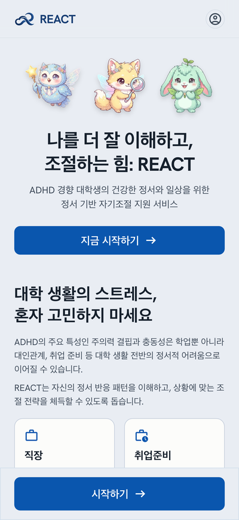
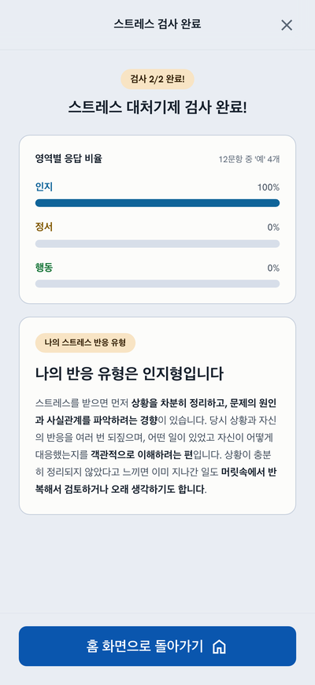
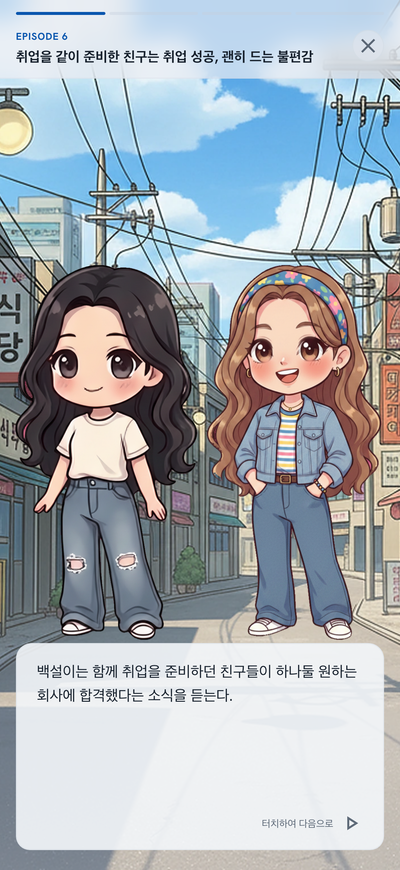
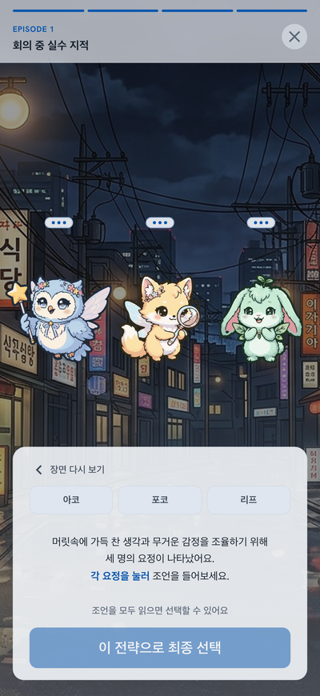
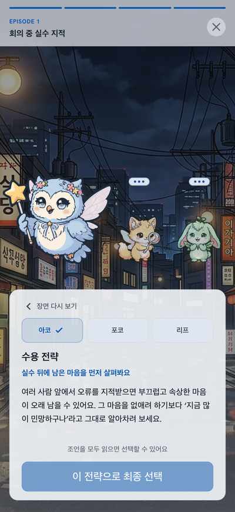
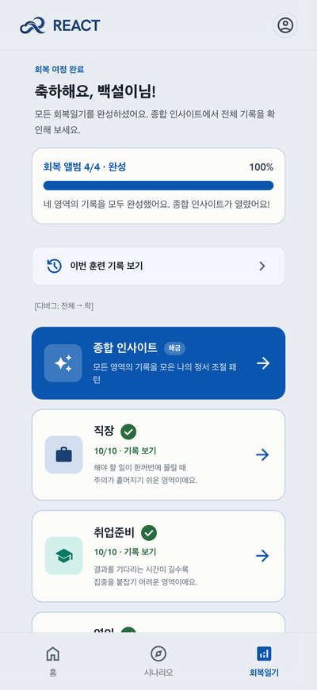
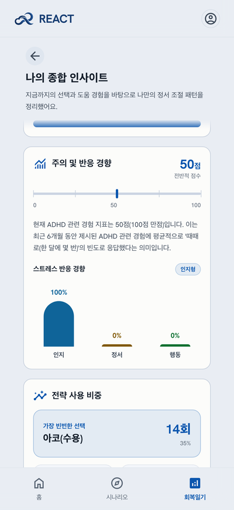
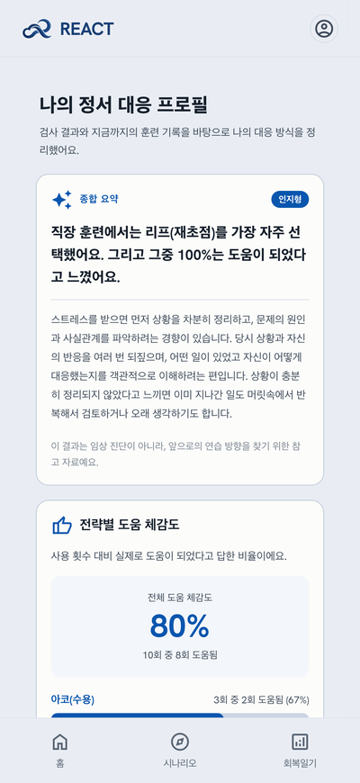
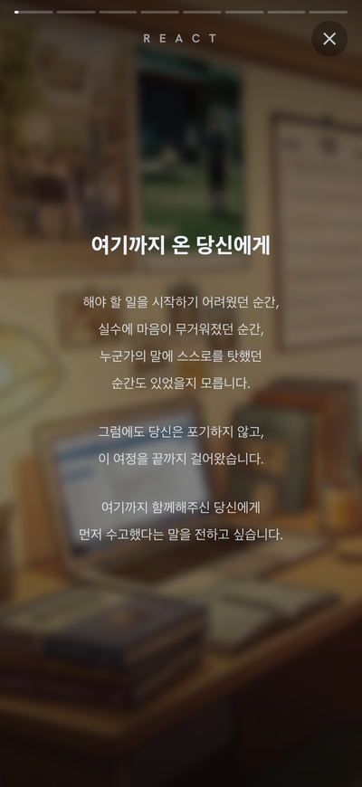

# 화면 모음

iPhone 17 화면(402×874, 3배율)으로 찍은 것을 폭 400px로 줄였다. 로컬 개발 서버 + Firebase 에뮬레이터에서
`syu-react-frontend/e2e/screenshots/`의 Playwright spec으로 찍는다 — 재촬영 절차는 그 폴더의 `playwright.config.ts`
머리 주석에 있다. 캐릭터는 여성, 닉네임 "백설이".

## 진입·검사

  
  
  

## 시나리오 플레이어

  
  
  

## 회복일기·보고서·엔딩

  
  
  
  

  

