# 화면 모음

진행 순서대로 묶었다. iPhone 17 화면(402×874, 3배율)을 폭 400px로 줄인 것이며, 로컬 개발 서버 +
Firebase 에뮬레이터에서 `syu-react-frontend/e2e/screenshots/`의 Playwright spec으로 찍는다 — 재촬영 절차는
그 폴더의 `playwright.config.ts` 머리 주석에 있다. 캐릭터는 여성, 닉네임 "백설이".

## 1. 진입 — 로그인·회원가입

  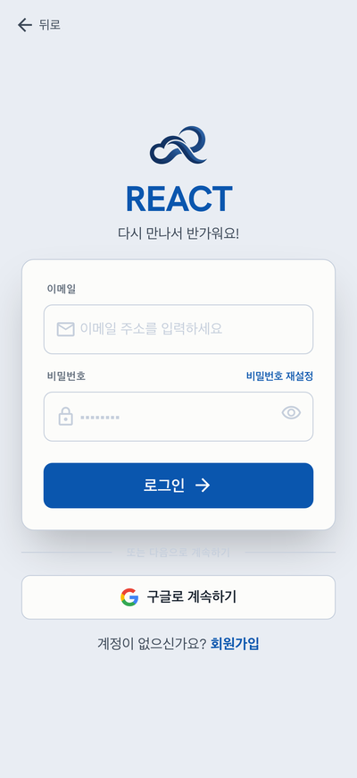
  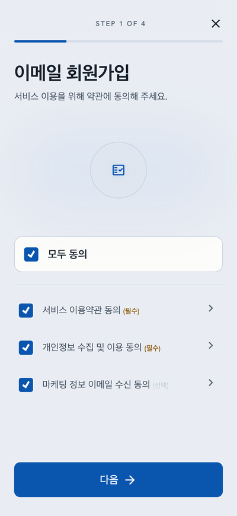
  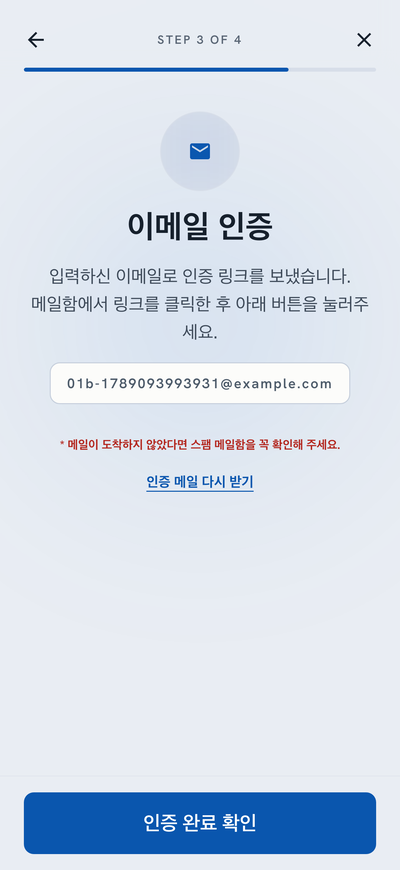
  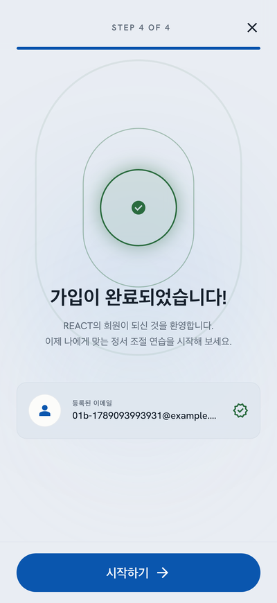

## 2. 온보딩 — 캐릭터와 검사 2종

  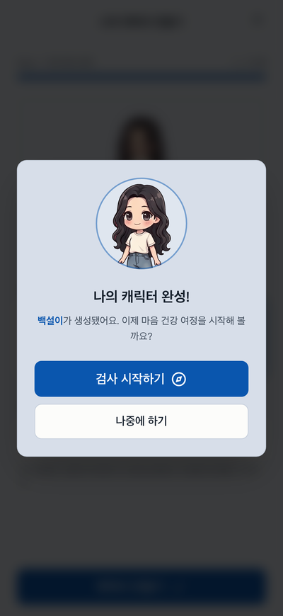
  
  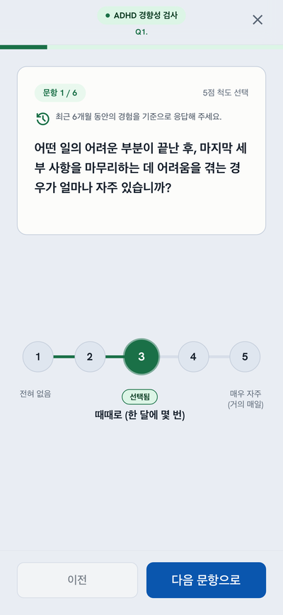
  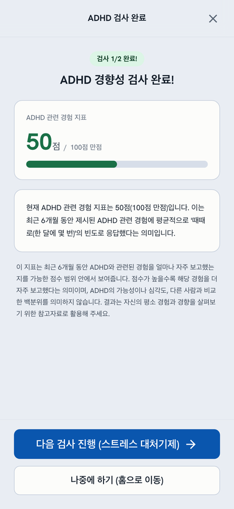

  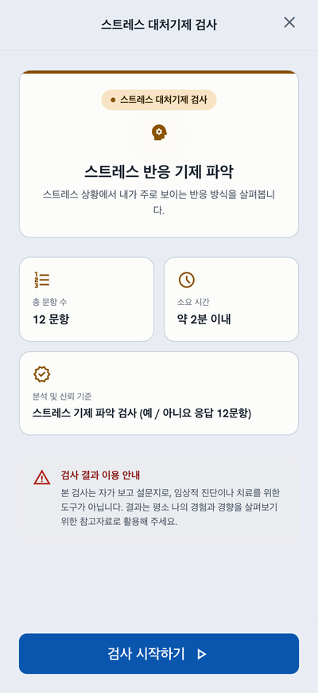
  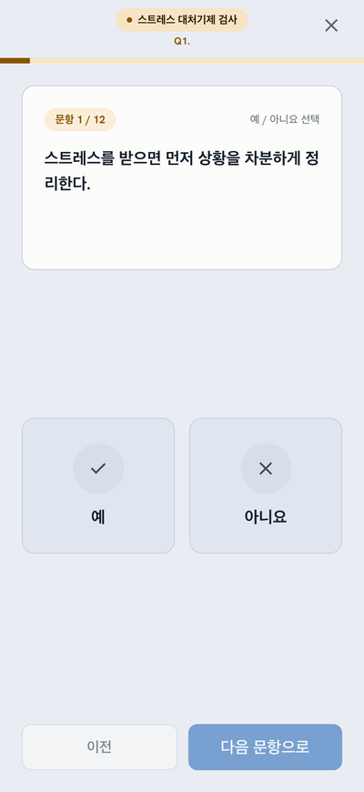
  
  

## 3. 시나리오 — 영역·에피소드 선택과 플레이

  
  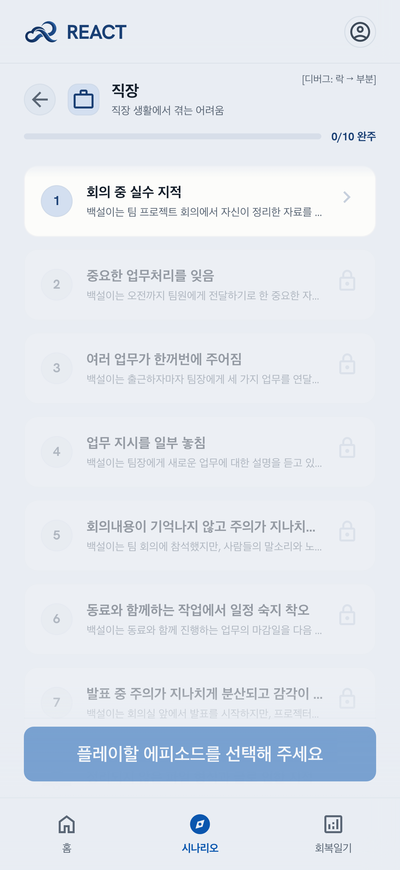
  
  

  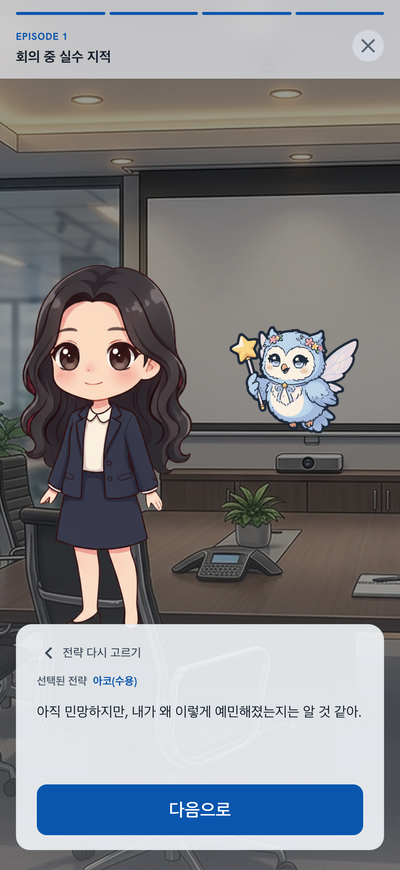
  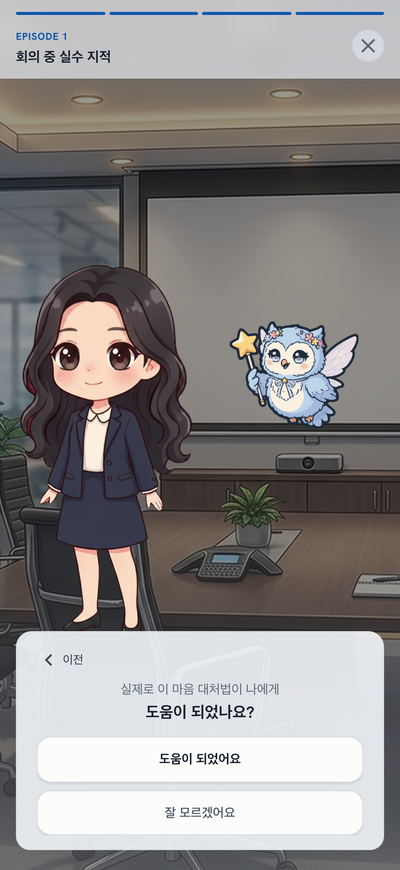
  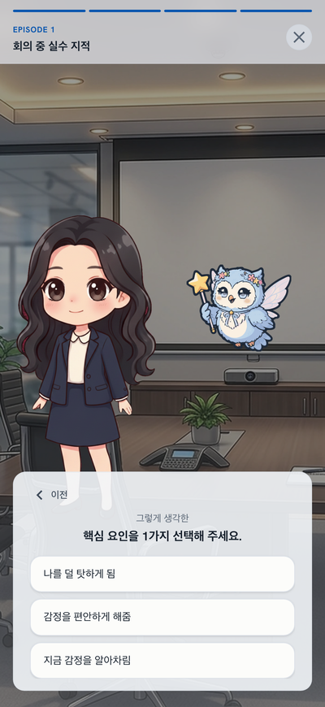

## 4. 회복일기·보고서

  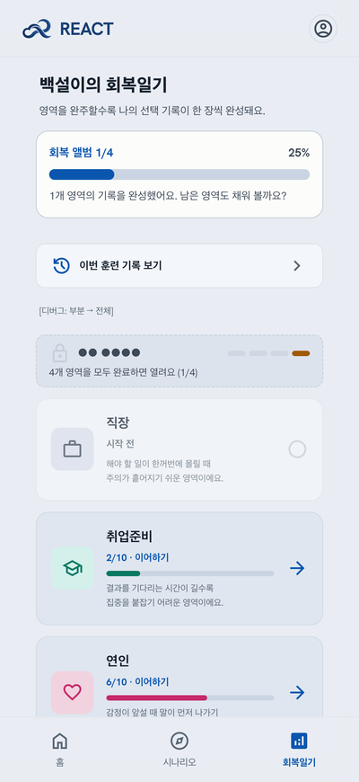
  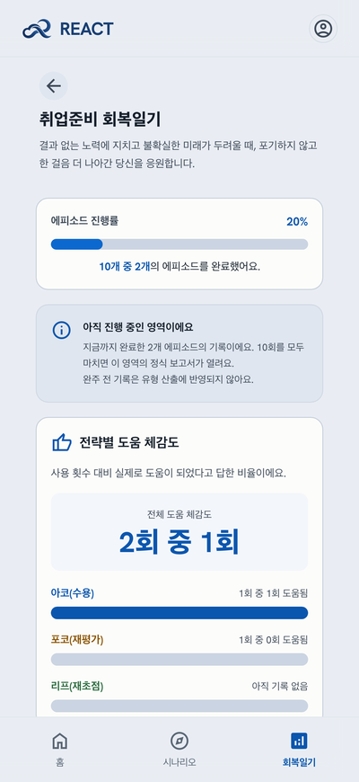
  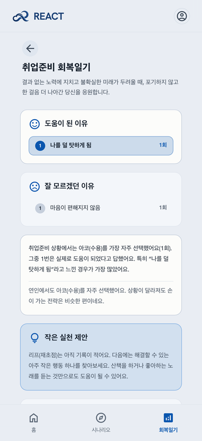
  

  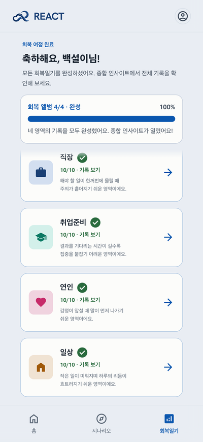
  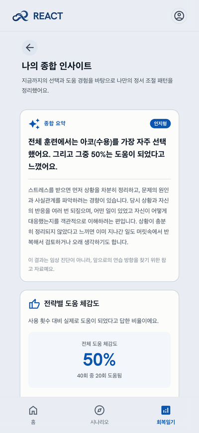
  
  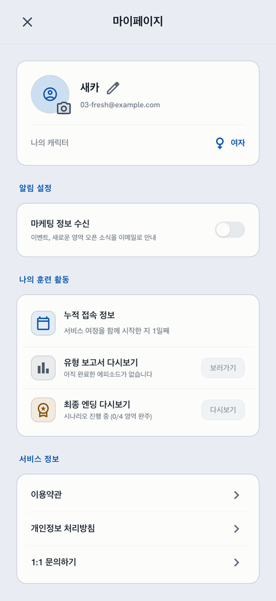

## 5. 엔딩

  
  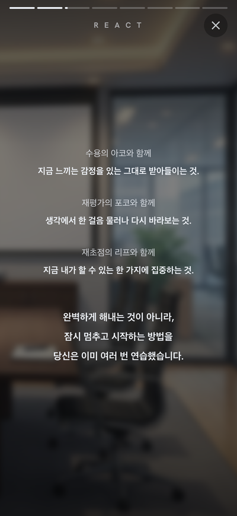
  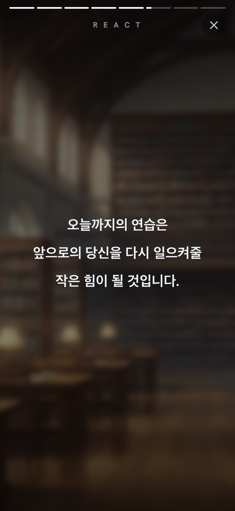
  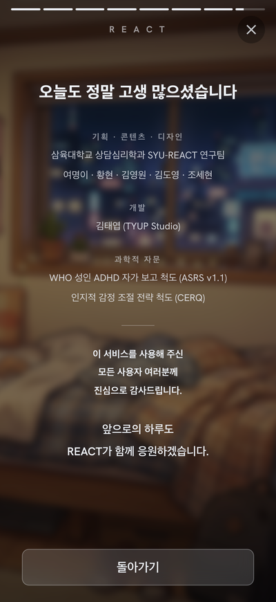

